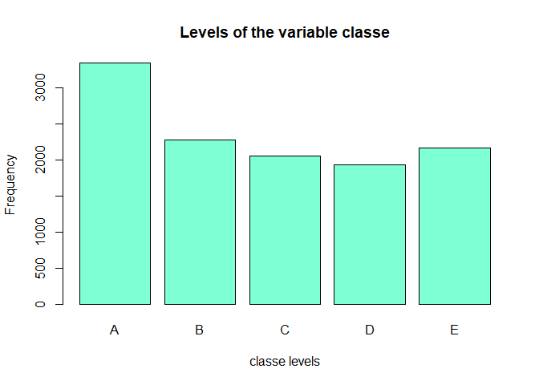
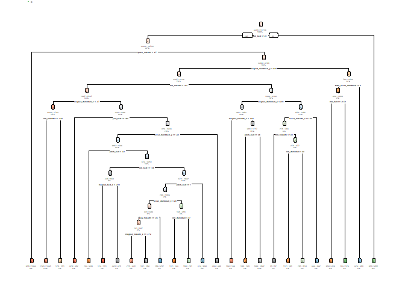

# Background

Using devices such as Jawbone Up, Nike FuelBand, and Fitbit it is now possible to collect a large amount of data about personal activity relatively inexpensively. These type of devices are part of the quantified self movement – a group of enthusiasts who take measurements about themselves regularly to improve their health, to find patterns in their behavior, or because they are tech geeks. One thing that people regularly do is quantify how much of a particular activity they do, but they rarely quantify how well they do it. In this project, your goal will be to use data from accelerometers on the belt, forearm, arm, and dumbell of 6 participants. They were asked to perform barbell lifts correctly and incorrectly in 5 different ways. More information is available from the website here: [Group Ware](http://groupware.les.inf.puc-rio.br/har) (see the section on the Weight Lifting Exercise Dataset).

# Data

The outcome variable is `classe`, a factor variable with 5 levels. For this data set, participants were asked to perform one set of 10 repetitions of the Unilateral Dumbbell Biceps Curl in 5 different fashions:

- Exactly according to the specification (Class A)
- Throwing the elbows to the front (Class B)
- Lifting the dumbbell only halfway (Class C)
- Lowering the dumbbell only halfway (Class D)
- Throwing the hips to the front (Class E)

# Overview

The model building workflow adopted for this task follows the pattern outlined in lectures:

    > question .. input .. features .. algorithm .. predict .. evaluation
    
Choices made at each step are described in the workflow below.


# Question

Create a model to predict the manner in which the subjects did the exercise using the accelerometer data as predictors. The outcome to be predicted is the “classe” variable.

# Input

Here, in the input section, the necessary libraries for the project are declared, as well as the configuration of certain data in order to start the work.

```r
#loading the necesary libraries
library(caret)
library(rpart)
library(rpart.plot)
library(randomForest)

#assign of the url and file names
trainingFile   <- 'pml-training.csv'
testFile <- 'pml-testing.csv'
trainingUrl    <- 'http://d396qusza40orc.cloudfront.net/predmachlearn/pml-training.csv'
testUrl  <- 'http://d396qusza40orc.cloudfront.net/predmachlearn/pml-testing.csv'

#creation of the directory for the submissions files
if (!file.exists("./submission")){
  dir.create("./submission")
}

#dowload of the data
download.file(trainingUrl,trainingFile)
download.file(testUrl,testFile)

#set set for the reproducible research
set.seed(7788)
```

# Data processing

Here we proceed to read the data and assign it to its corresponding variable, in addition to remove the NA values from the other data, looking at the **Figure 1** in the appendix we can see the frequency of the levels in the variable `classe` and and you can see that that level A have higher frequency.

```r
#reading the data
trainData <- read.csv(trainingFile, na.strings = c("NA","#DIV/0!", ""))
testData <- read.csv(testFile, na.strings = c("NA","#DIV/0!", ""))

#removing the NA values from the data
trainData <- trainData[,colSums(is.na(trainData))==0]
testData <- testData[, colSums(is.na(trainData))==0]
```


# Features

In this section the data is separated and the columns that are unnecessary for the analysis are eliminated, in addition to declaring the `classe` column as a factor for its later use.

```r
#separating unnecessary columns for analysis
trainData <- trainData[,-c(1:7)]
testData <- testData[,-c(1:7)]

#setting the classe column as factor
trainData$classe <- factor(trainData$classe)
```


# Algorithm

Now the training and testing tables are created separating the original data by 60% for training and 40% for testing.

```r
#getting both training and testing data for the analysis
subSample <- createDataPartition(y = trainData$classe, p = 0.60, list = FALSE)
subTrainData <- trainData[subSample,]
subTestData <- trainData[-subSample,]
```


# Predict


Here the decision tree model will be tested first, first the model is created, then the prediction is created with the model and finally the matrix confusion is made to see its interception, in **Figure 2** you can see how complicated that model is. After seeing that the model is not optimal for the tests, another model is created but this time with random forest, and both previous steps are done, which shows us that it is viable for the tests.

```r
#the model is created
decisionTreeMod <- rpart(classe ~ .,data = subTrainData, method = "class")

#the predict is calculated
decisionTreePredict <- predict(decisionTreeMod, subTestData, type = "class")

#the confusionMatrix is created
confusionMatrix(subTestData$classe, decisionTreePredict)
```

```
## Confusion Matrix and Statistics
## 
##           Reference
## Prediction    A    B    C    D    E
##          A 1997   77   59   68   31
##          B  241  929  155  102   91
##          C   17   76 1154   83   38
##          D   75   87  201  823  100
##          E   33   93  177   70 1069
## 
## Overall Statistics
##                                           
##                Accuracy : 0.7612          
##                  95% CI : (0.7516, 0.7706)
##     No Information Rate : 0.3012          
##     P-Value [Acc > NIR] : < 2.2e-16       
##                                           
##                   Kappa : 0.6974          
##                                           
##  Mcnemar's Test P-Value : < 2.2e-16       
## 
## Statistics by Class:
## 
##                      Class: A Class: B Class: C Class: D Class: E
## Sensitivity            0.8451   0.7361   0.6609   0.7182   0.8044
## Specificity            0.9571   0.9105   0.9649   0.9309   0.9428
## Pos Pred Value         0.8947   0.6120   0.8436   0.6400   0.7413
## Neg Pred Value         0.9348   0.9474   0.9086   0.9508   0.9594
## Prevalence             0.3012   0.1608   0.2225   0.1461   0.1694
## Detection Rate         0.2545   0.1184   0.1471   0.1049   0.1362
## Detection Prevalence   0.2845   0.1935   0.1744   0.1639   0.1838
## Balanced Accuracy      0.9011   0.8233   0.8129   0.8245   0.8736
```

```r
#the model is created
randomForestMod <- randomForest(classe ~ ., data = subTrainData, method = "class")

#the predict is calculated
randomForestPredict <- predict(randomForestMod, subTestData, type = "class")

#the confusionMatrix is created
confusionMatrix(subTestData$classe, randomForestPredict)
```

```
## Confusion Matrix and Statistics
## 
##           Reference
## Prediction    A    B    C    D    E
##          A 2231    1    0    0    0
##          B    5 1508    5    0    0
##          C    0    8 1355    5    0
##          D    0    0   15 1270    1
##          E    0    0    0    1 1441
## 
## Overall Statistics
##                                           
##                Accuracy : 0.9948          
##                  95% CI : (0.9929, 0.9962)
##     No Information Rate : 0.285           
##     P-Value [Acc > NIR] : < 2.2e-16       
##                                           
##                   Kappa : 0.9934          
##                                           
##  Mcnemar's Test P-Value : NA              
## 
## Statistics by Class:
## 
##                      Class: A Class: B Class: C Class: D Class: E
## Sensitivity            0.9978   0.9941   0.9855   0.9953   0.9993
## Specificity            0.9998   0.9984   0.9980   0.9976   0.9998
## Pos Pred Value         0.9996   0.9934   0.9905   0.9876   0.9993
## Neg Pred Value         0.9991   0.9986   0.9969   0.9991   0.9998
## Prevalence             0.2850   0.1933   0.1752   0.1626   0.1838
## Detection Rate         0.2843   0.1922   0.1727   0.1619   0.1837
## Detection Prevalence   0.2845   0.1935   0.1744   0.1639   0.1838
## Balanced Accuracy      0.9988   0.9962   0.9917   0.9964   0.9996
```


# Evaluation

The out-of-sample error is 0.0069 or 0.69%. This correspond to the proportion of incorrect classified observation over the correct classified observation. The test data set comprises 20 cases with an accuracy above 99% on our cross-validation data, we can expect that very few of the test samples will be missclassified.

Giving an answer to the initial question, Confusion matrices show that the Random Forest algorithm performs better than decision trees. The precision for the random forest model was 0.993 (95% CI: (0.991, 0.9948)) compared to 0.760 (95% CI: (0.7499, 0.770)) for the decision tree model, Under this analysis it was decided to maintain the random forest model for the prediction tests with the testing data.

# Submission

Finally, the tests are made with the 20 cases of the testing data, making the prediction with the chosen model and saving the results in files in case it is necessary for a future investigation.

```r
#prediction of the 20 cases
submissionPredict <- predict(randomForestMod, testData, type = "class")
submissionPredict
```

```
##  1  2  3  4  5  6  7  8  9 10 11 12 13 14 15 16 17 18 19 20 
##  B  A  B  A  A  E  D  B  A  A  B  C  B  A  E  E  A  B  B  B 
## Levels: A B C D E
```

```r
#writing the files of each case
writeFiles = function (x){
  n = length(x)
  for(i in 1:n){
    filename = paste0("./submission/test#", i ,".txt")
    write.table(x[i], file = filename, quote = FALSE, row.names = FALSE, col.names = FALSE)
  }
}
writeFiles(submissionPredict)
```

# Appendix

## Figure 1

```r
plot(subTrainData$classe, col="aquamarine", main="Levels of the variable classe", xlab="classe levels", ylab="Frequency")
```

<!-- -->

## Figure 2

```r
rpart.plot(decisionTreeMod, extra=102, under=TRUE, faclen=0)
```

<!-- -->

